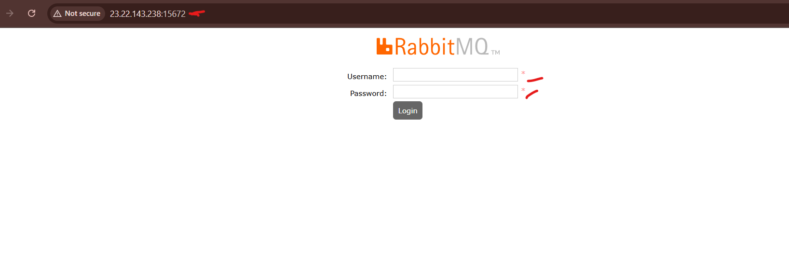

# multi-container

Here's a step-by-step guide to setting up a multi-container application with Nginx, RabbitMQ (rmq), Memcached (mc), MySQL using Docker Compose and deploying it on AWS EC2.

__Step 1: Prepare Your AWS EC2 Instance__

- Launch an EC2 instance

- Use an Ubuntu 22.04 or Amazon Linux 2 instance.

- Choose an instance type (e.g., t3.medium for better performance).

- Configure security groups:

- Allow SSH (port 22) from your IP.

- Allow HTTP (port 80) and HTTPS (port 443) from anywhere.

- Allow RabbitMQ (port 5672 & 15672) if needed.

- Allow MySQL (port 3306) if remote access is required.


- Connect to Your EC2 Instance `ssh -i your-key.pem ubuntu@your-ec2-public-ip`

- Update and Install Dependencies, Enable and Start Docker

```
sudo apt update && sudo apt upgrade -y
sudo apt install -y docker.io docker-compose unzip
sudo systemctl enable docker
sudo systemctl start docker
sudo usermod -aG docker $USER
```

Log out and log back in for changes to take effect.

__Step 2: Create a Docker Compose File__

- Create a Project Directory `mkdir -p ~/multi-container-app && cd ~ multi-container-app`

- Create a docker-compose.yml file and Define Services in docker-compose.yml

```
version: '3.8'

services:
  app:
    build: ./app
    container_name: my_app
    restart: always
    depends_on:
      - mysql_db
      - rabbitmq_server
      - memcached_server
    ports:
      - "5000:5000"

  nginx:
    image: nginx:latest
    container_name: nginx_server
    restart: always
    ports:
      - "80:80"
    volumes:
      - ./nginx.conf:/etc/nginx/nginx.conf
    depends_on:
      - app

  mysql_db:
    image: mysql:8
    container_name: mysql_db
    restart: always
    environment:
      MYSQL_ROOT_PASSWORD: ogechukwu
      MYSQL_DATABASE: mysql
    ports:
      - "3306:3306"

  rabbitmq_server:
    image: rabbitmq:3-management
    container_name: rabbitmq_server
    environment:
      RABBITMQ_DEFAULT_USER: oge
      RABBITMQ_DEFAULT_PASS: ogechukwu1
    restart: always
    ports:
      - "5672:5672"
      - "15672:15672"

  memcached_server:
    image: memcached:latest
    container_name: memcached_server
    restart: always
    ports:
      - "11211:11211"
```

- Create the app directory `mkdir -p ~/multi-container-app/app
cd ~/multi-container-app/app`

- Create a Dockerfile for the application `nano Dockerfile`

```
FROM python:3.9

WORKDIR /app

COPY requirements.txt .

RUN pip install --no-cache-dir -r requirements.txt

COPY . .

CMD ["python", "app.py"]

```

- Create a requirements.txt file `nano requirements.txt`

```
flask
mysql-connector-python
pymemcache  # This replaces 'memcache'
pika  # For RabbitMQ

```

- Create app.py (a simple Flask app) `nano app.py`

```
from flask import Flask
from pymemcache.client import base
import mysql.connector
import pika

app = Flask(__name__)

# Initialize Memcached client
memcached_client = base.Client(('memcached_server', 11211))
memcached_client.set('test_key', "Ogechukwu says: 'In the world of possibilities, love and innovation create magic!'")

@app.route('/')
def home():
    return f"Hello from the Multi-Container App! {memcached_client.get('test_key').decode('utf-8')}"

if __name__ == '__main__':
    app.run(host='0.0.0.0', port=5000)

```


__Step 3: Configure Nginx__

- Create an Nginx configuration file `nano nginx.conf`

```
events { }

http {
    server {
        listen 80;
        location / {
            proxy_pass http://app:5000;
            proxy_set_header Host $host;
            proxy_set_header X-Real-IP $remote_addr;
        }
    }
}

```

__Step 4: Deploy the Application__

- Start the Containers `docker-compose up -d`

- Verify Running Containers `docker ps`

- Check Application Logs `docker-compose logs -f`


__Step 5: Access and Test Services__

- Application: http://your-ec2-public-ip


- RabbitMQ UI: http://your-ec2-public-ip:15672 (Login: oge/ogechukwu1)




- Install MySQL Client

- Run the following command to install the MySQL client: `sudo apt update`
  
`sudo apt install mysql-client -y`

`sudo systemctl start mysql`

`sudo systemctl enable mysql`

`sudo systemctl status mysql`

- Verify MySQL is Listening on Port 3306 `sudo ss -tulnp | grep 3306`


- After installation, check if MySQL client is installed by running: `mysql --version`

- MySQL: Connect using `mysql -h your-ec2-public-ip -u root -p`


- Memcached: Test with `telnet your-ec2-public-ip 11211`


- You're successfully connected to the Memcached server on port 11211 via Telnet. If you want to check if it's working, try typing: `stats`  


- Then press Enter. This should return various statistics about the Memcached server.

- To exit Telnet, press: `Ctrl + ]` then type `quit` and press enter.


- Enable Auto-start and Monitoring

- Restart containers on reboot `sudo crontab -e`

- Once inside the crontab editor, scroll to the bottom and add this line: `@reboot cd ~/multi-container-app && docker-compose up -d` (This ensures that your Docker containers start automatically when the system reboots.)


